
<h1 align="center">社区物资交易互助平台</h1>

## 简介
社区物资交易互助平台：角色分为管理员、用户；支持物资捐赠、订单管理、用户留言、论坛互动功能，平台促进资源共享与社区互助，提供多样化交易及用户信息管理。    --计算机毕业设计源码；毕设源码；java毕业设计源码

## 联系方式

<h3 align="center">获取完整代码与数据库文件 + 微信：deepguan QQ: 86050149 QQ群: 783742310</h3>

<h3 align="center">可帮忙远程部署 包运行成功！提供远程部署、修改代码、设计文档指导、代码讲解等服务！</h3>

## 功能介绍（完整见运行截图）
管理员：负责系统的整体运营与管理。主要功能包括用户管理、基础数据管理、论坛管理、求助留言板管理、公告信息管理、物资管理及后台数据的增删改查操作。此外，管理员可以查看和维护物资捐赠与交易记录，确保平台信息的有效性与准确性。支持对订单进行全面管理及用户信息的查看与编辑，能够通过系统进行角色分配、权限设置及信息审核。

普通用户：可以进行注册、登录及安全退出操作，便于获取平台完整功能。用户在平台主页可通过导航栏访问物资信息，包括论坛、公告、求助等模块。支持浏览及发布物资信息，实现物资捐赠、交易等操作。用户同样可在论坛参与讨论，发布和查看帖子，进行信息交流与共享。平台提供多样化的支付选项，使用户能够便捷地进行账户充值和订单支付。

访客：无需登录即可访问平台主页及浏览公开信息。可以查看公告信息、论坛帖子列表及部分物资信息，但无法进行实际交易或捐赠操作。平台提供直观的界面帮助访客了解社区资源与共享信息。

开发者：利用Spring Boot框架开发此平台，确保系统功能模块的高效及可持续拓展性。功能涵盖注册登录、用户管理、物资管理、订单管理等模块。开发者致力于提升用户体验，通过接口优化与系统调试，确保平台运行流畅、响应迅速，能够适应社区物资交换的多样需求。

## 运行截图
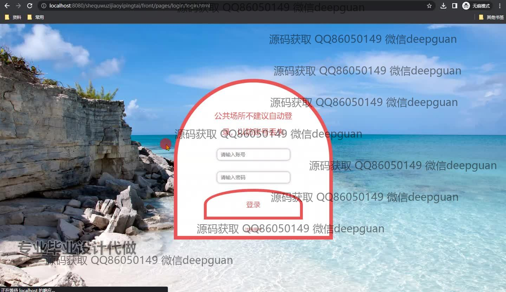
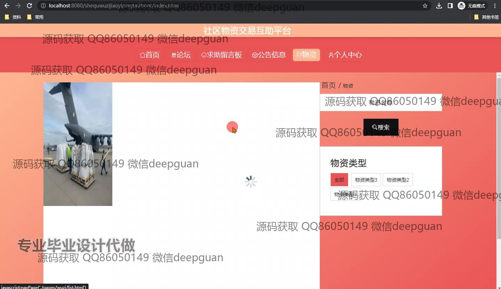
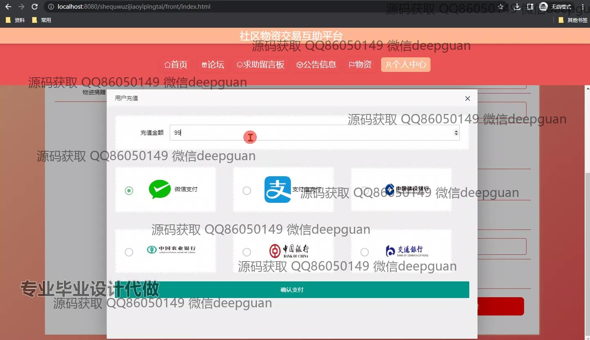
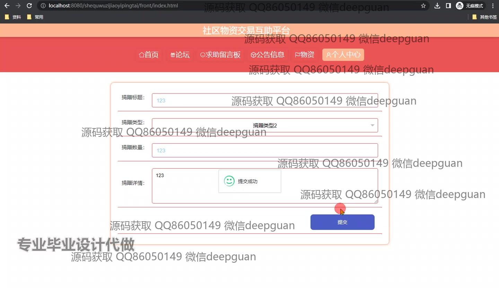
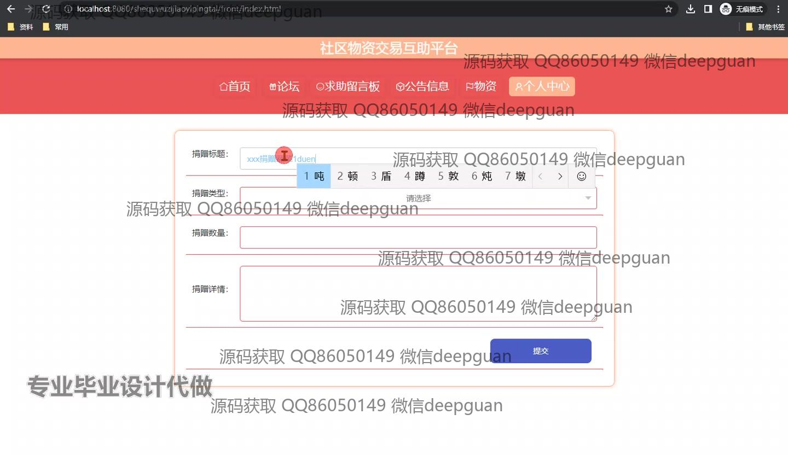
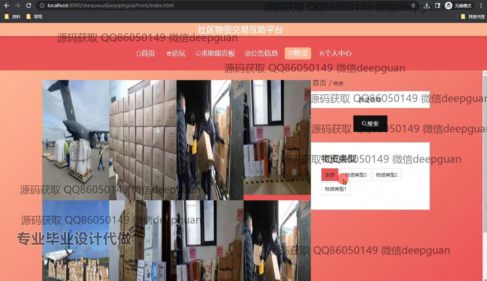
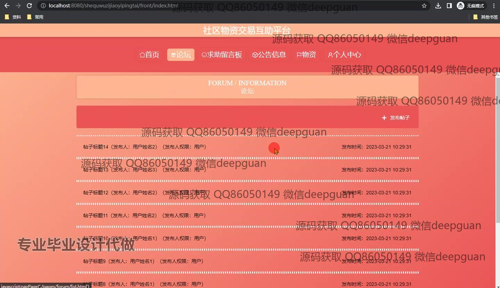
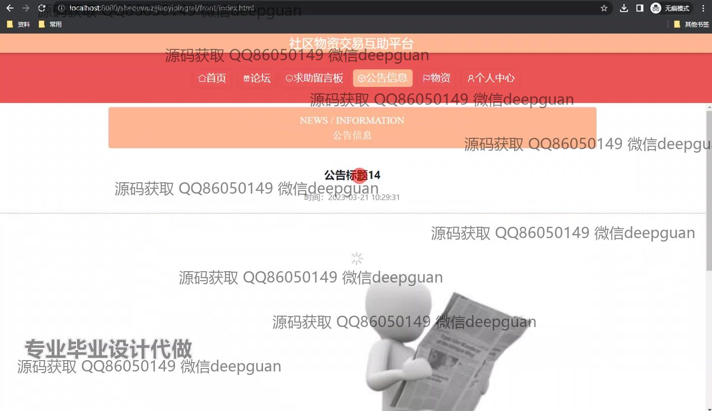
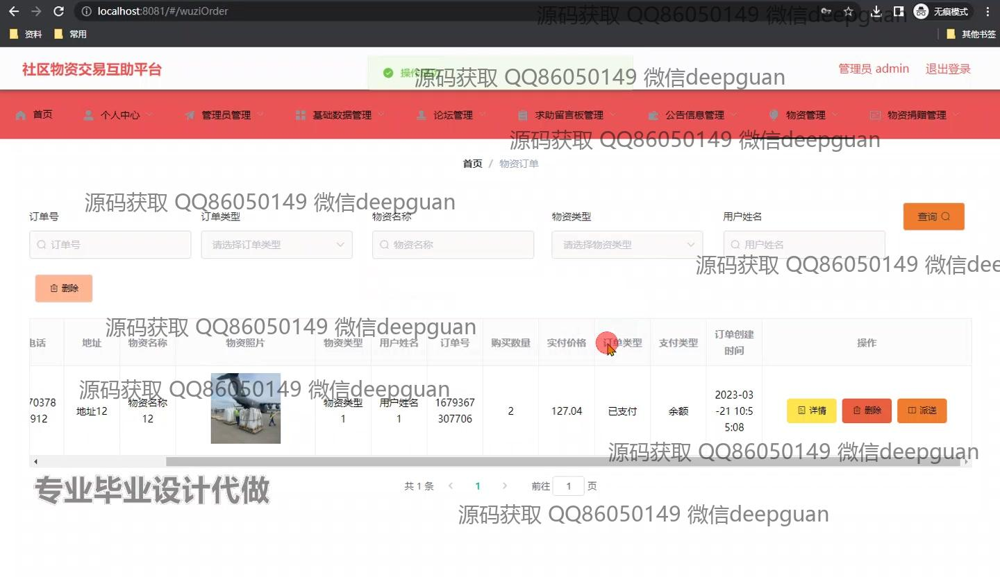
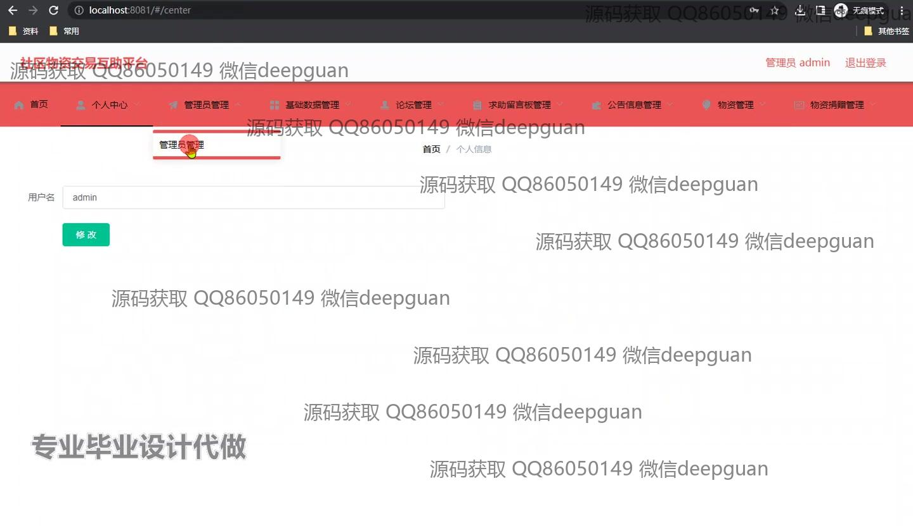
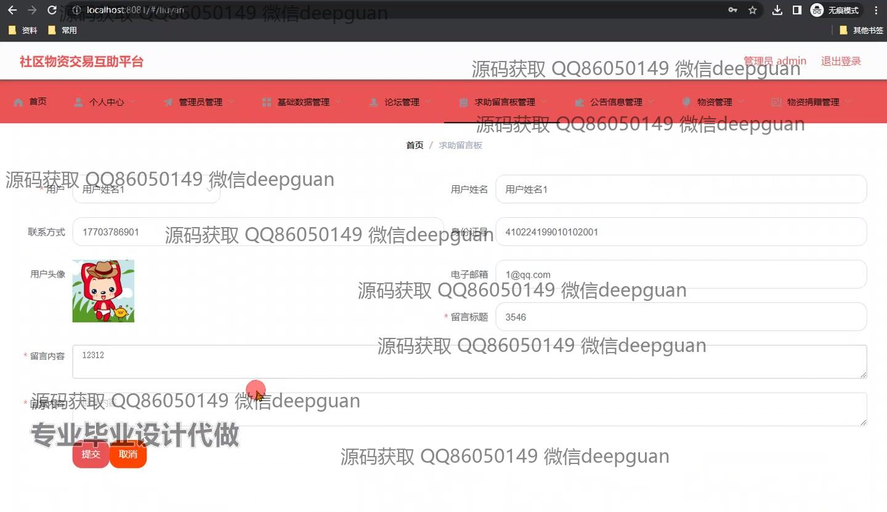
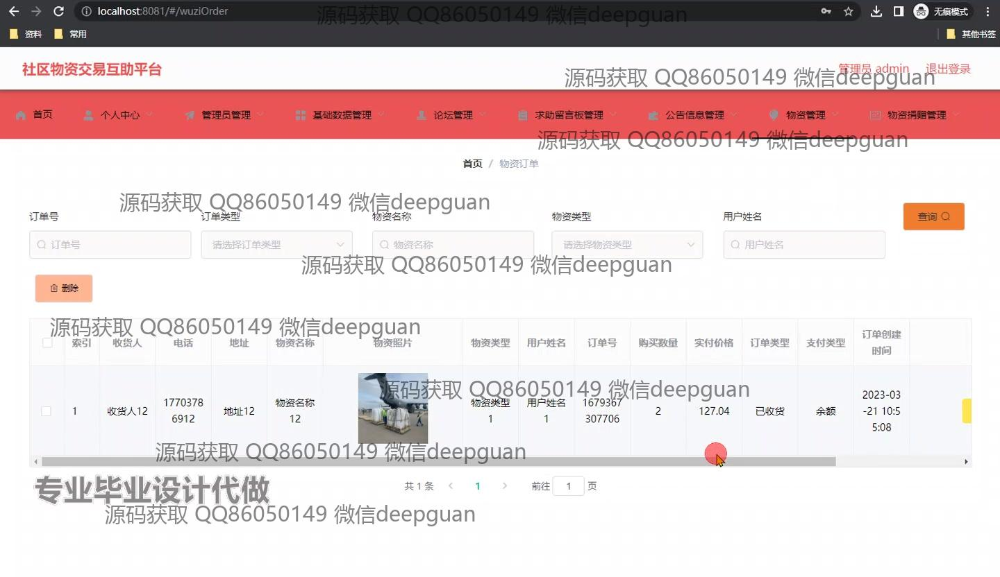
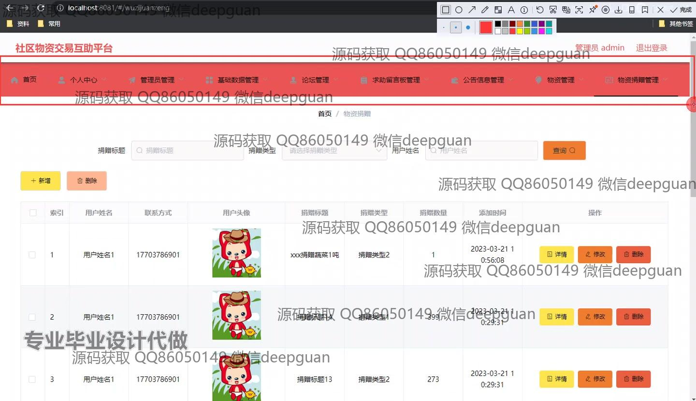
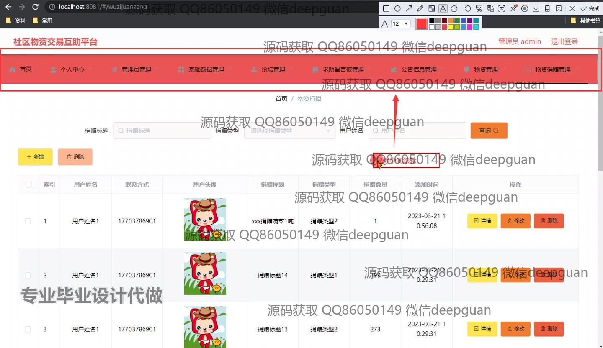
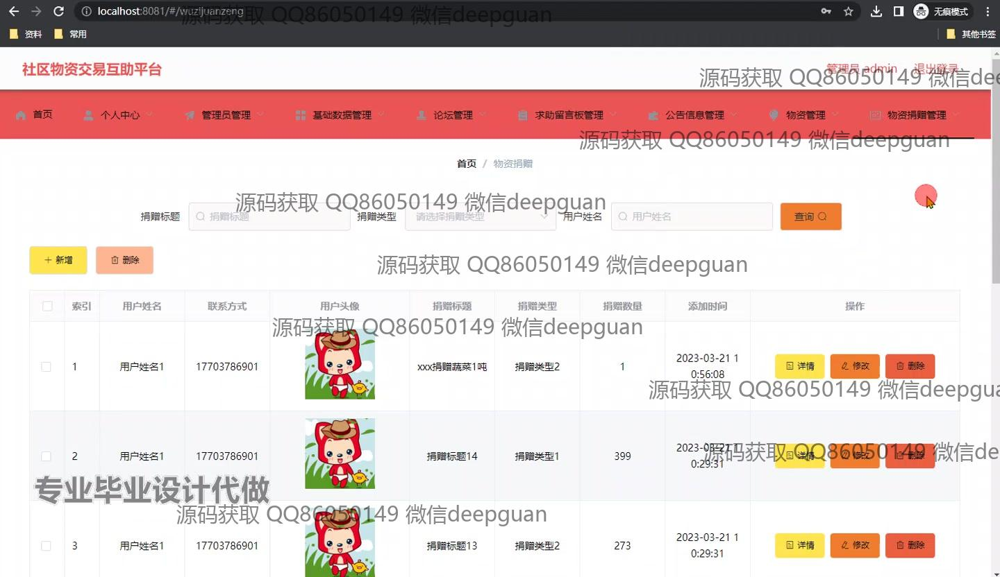

本代码来源于网络,仅供学习参考使用!

